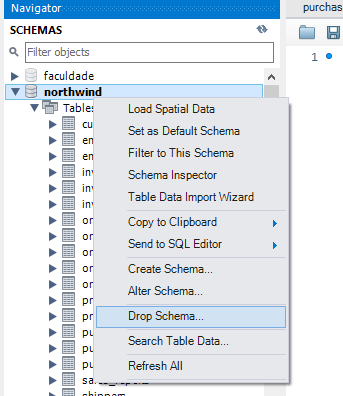

# Bem vindo ao repositório do projeto All For One

Este projeto foi desenvolvido durante o curso da Trybe para inicializar o trabalho com banco de dados relacionais, incluindo filtragem de dados e manipulação de tabelas. Os requisitos do projeto estão detalhados a seguir.

# O que deverá ser desenvolvido

Hoje você fará um projeto com o codinome *All For One* em que praticará todos os conceitos de SQL já ensinados até aqui. Porém, você vai usar um banco de dados totalmente diferente, então dê tchau para o `sakila` e dê boas vindas ao `Northwind`, que será usado neste projeto. As instruções de como restaurar o banco podem ser lidas a seguir.

# Instruções para restaurar o banco de dados `Northwind`

1. Faça o download do arquivo de backup [aqui](northwind.sql) clicando em "Raw", depois clicando com botão direito e selecionando "Salvar como" para salvar o arquivo em seu computador.
2. Abra o arquivo com algum editor de texto, e selecione todo o conteúdo do arquivo usando `CTRL-A`.
3. Abra o MySQL Workbench.
4. Abra uma nova janela de query e cole dentro dela todo o conteúdo do arquivo `northwind.sql`.
5. Selecione todo o código com o atalho `CTRL-A` e depois clique no icone de trovão para executar a query.

    
6. Aguarde alguns segundos (espere em torno de 30 segundos antes de tentar fazer algo).
7. Clique no botão apontado na imagem a seguir para atualizar a listagem de banco de dados.

    
7. Verifique se o banco restaurado possui todas as seguintes tabelas:

    
8. Clique com botão direito em cada tabela e selecione "Select Rows" e certifique-se que todas as tabelas possuem registros. Caso tenha alguma faltando, faça o passo a seguir. Caso contrário, pode ir para próxima seção.
9. Caso existam tabelas faltando, drope o banco de dados, clicando com o botão direito em cima do banco de dados northwind e selecionando "Drop Schema", e refaça os passos novamente, dessa vez aguardando um tempo maior quando executar o script de restauração.

    

# Como desenvolver e entregar este projeto

Temos, a seguir, uma série de desafios com diferentes níveis de complexidade que devem ser resolvidos cada um em seu arquivo próprio.

1. Leia a pergunta e crie um arquivo chamado `desafioX.sql`, em que X é o número do desafio.
2. O arquivo deve conter apenas o código SQL do desafio resolvido. **Não se esqueça de incluir o ponto e vírgula (";")** no final de suas queries e também de **colocar o nome do banco_de_dados.tabela por completo**, como no exemplo a seguir.
```sql
SELECT * FROM northwind.orders;
```
4. Faça isso até finalizar todos os desafios e depois siga as instruções de como entregar o projeto em **Instruções para entregar seu projeto**.
---

## Desafios Iniciais

Monte queries para encontrar as seguintes informações:

1. Exiba apenas os nomes do produtos na tabela `products`.
2. Exiba todas as colunas da tabela `products`.
3. Escreva uma query que mostre a coluna que representa a primary key da tabela `products`.
4. Conte quantos registros existem em `product_name` de `products`.
5. Monte uma query que exiba os registros da tabela `products`  a partir do registro 4 até o 13, não use `where` ou `order by`.
6. Mostre as colunas `product_name` e `ID` da tabela `products` de maneira que os resultados estejam em ordem alfabética dos nomes.
7. Mostre os 5 primeiros registros da coluna `id` da tabela `products`, quando esta está em ordem decrescente.
8. Faça uma consulta que retorne três colunas. Na primeira coluna, exiba a soma de `5 + 6` (essa soma deve ser realizada pelo SQL). Na segunda coluna deve haver a palavra "de". E por fim, na terceira coluna, exiba a soma de `2 + 8` (essa soma deve ser realizada pelo SQL). A primeira coluna deve se chamar "A", a segunda coluna deve se chamar "Trybe" e a terceira coluna deve se chamar "eh". Não use colunas pre-existentes, apenas o que for criado na hora.

---

## Desafios sobre filtragem de dados

9. Mostre todos os valores de `notes` da tabela `purchase_orders` que não são nulos.
10. Mostre todos os dados da tabela `purchase_orders` em ordem decrescente ordenados por `created_by` onde `created_by` é maior ou igual a 3.
11. Exiba os dados de `notes` da tabela `purchase_orders` e mostre apenas os dados de `notes` entre 30 a 39.
12. Mostre as datas (`submitted_date`) de `purchase_orders` onde `submitted_date` é do dia 14 do mês de janeiro do ano 2006.
13. Mostre o `supplier_id` das `purchase_orders` onde o `supplier_id` seja 1 ou 3.
14. Mostre os `supplier_id` da `purchase_orders` onde o `supplier_id` sejam 1 a 3.
15. Mostre somente as horas da `submitted_date` de todos registros de `purchase_orders`.
16. Exiba a `submitted_date` das `purchase_orders` que estão entre 2006-01-26 00:00:00 a 2006-03-27 23:59:59.
17. Mostre os registros da coluna `supplier_id` das `purchase_orders` em que os `supplier_id` sejam tanto 1 ou 6.
18. Mostre os registros de purchase_orders que tem o `supplier_id` igual a 3 e `status_id` igual a 2.
19. Quantos pedidos foram feitos na tabela `orders` pelo `employee_id` igual a 6 ou 5, e que foram enviados através do método `shipper_id` = 2 ?

---

## Desafios Manipulação de tabelas

20. Adicione ao `order_details` uma linha com os seguintes dados: `order_id`: 69, `product_id`: 80, `quantity`: 15.0000, `unit_price`: 15.0000, `discount`: 0, `status_id`: 2, `date_allocated`: NULL, `purchase_order_id`: NULL e `inventory_id`: 129 (o Id deve ser incrementado automaticamente).
21. Adicione duas linhas ao `order_details` com os mesmos dados. Esses dados são novamente `order_id`: 69, `product_id`: 80, `quantity`: 15.0000, `unit_price`: 15.0000, `discount`: 0, `status_id`: 2, `date_allocated`: NULL, `purchase_order_id`: NULL e `inventory_id`: 129 (o Id deve ser incrementado automaticamente).
22. Atualize os dados de `discount` do `order_details` para 15.
23. Atualize os dados de `discount` da tabela `order_details` para 30 cuja `unit_price` seja menor que 10.0000.
24. Atualize os dados de discount da tabela `order_details` para 45 cuja `unit_price` seja maior que 10.0000 e o id seja um número entre 30 a 40.
25. Delete todos os dados em que a `unit_price` da tabela `order_details` seja menor que 10.0000.
26. Delete todos os dados em que a `unit_price` da tabela `order_details` seja maior que 10.0000.
27. Delete todos os dados da tabela `order_details`.
